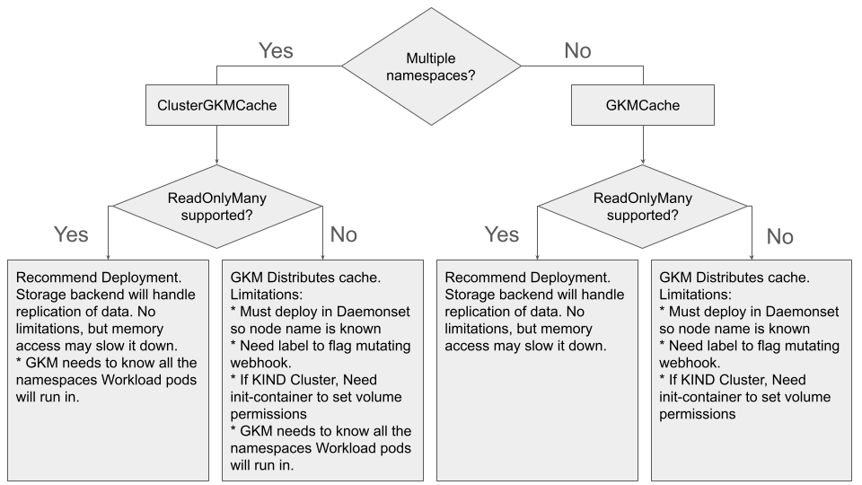
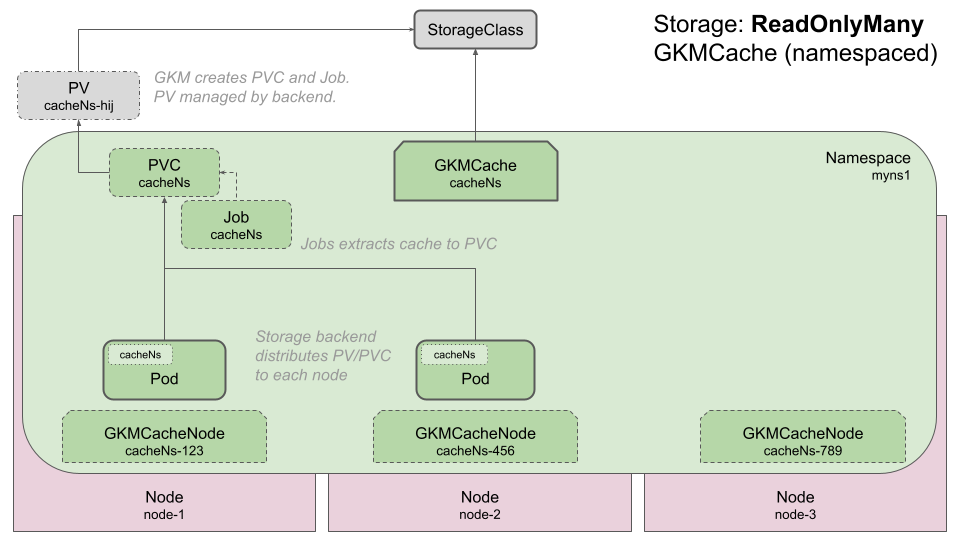
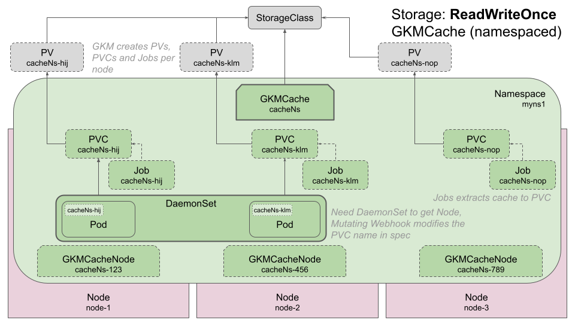
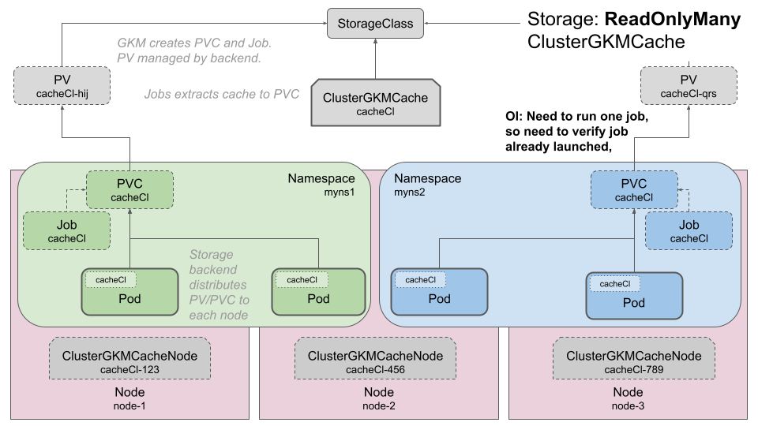
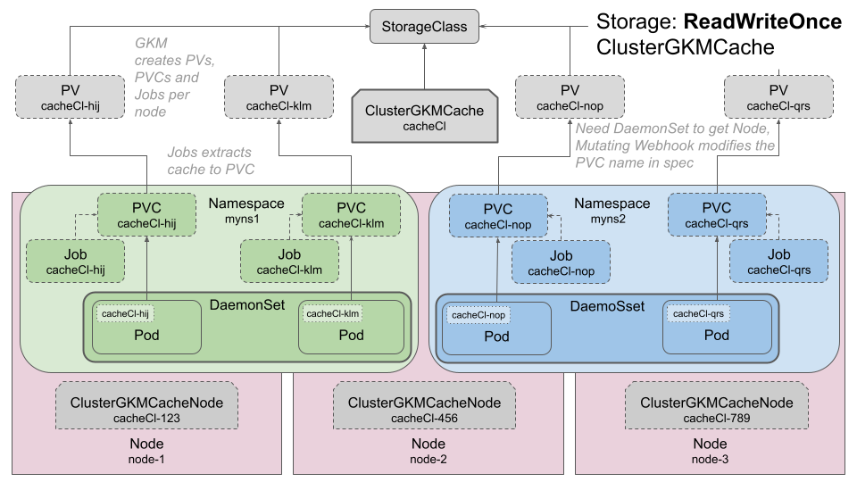

# Deployment Options

This document describes the different deployment options for GKM.
The following are covered:

- [Namespace and Backend Scenarios](#namespace-and-backend-scenarios)
  - [Namespace Scoped and AccessMode ReadOnlyMany](#namespace-scoped-and-accessmode-readonlymany)
  - [Namespace Scoped and AccessMode ReadWriteOnce](#namespace-scoped-and-accessmode-readwriteonce)
  - [Cluster Scoped and AccessMode ReadOnlyMany](#cluster-scoped-and-accessmode-readonlymany)
  - [Cluster Scoped and AccessMode ReadWriteOnce](#cluster-scoped-and-accessmode-readwriteonce)
- [KIND CLuster](#kind-clusters)
- [Image Signature Verification with Cosign V2 or V3](#image-signature-verification-with-cosign-v2-or-v3)
- [Node Taints and Restrictions](#node-taints-and-restrictions)
- [Debugging](#debugging)
  - [GKMCache Stuck in Pending](#gkmcache-stuck-in-pending)

## Namespace and Backend Scenarios

The two major factors that dictate deployment are:

- **Namespace of the GPU Kernel Cache:**
  If a given GPU Kernel Cache will only be deployed in a single Kubernetes
  Namespace, then the `GKMCache` should be used.
  If a given GPU Kernel Cache will be deployed in multiple Kubernetes Namespaces,
  then the `ClusterGKMCache` should be used.
- **Cluster Storage Backend:**
  If the Kubernetes StorageClass backend supports an Access Mode of `ReadOnlyMany`,
  then the storage backend can distribute extracted GPU Kernel Cache to each
  node to each node.
  If the Kubernetes StorageClass backend does not support an Access Mode of
  `ReadOnlyMany`, GKM needs to handle the distribution of the extracted GPU Kernel
  Cache to each node.
  If this is the case, certain concession need to be made.



GKM downloads and extracts the GPU Kernel Cache stored in an OCI Image into a
Kubernetes PersistentVolumeClaim (PVC).
So the storage backing the PVC dictates a lot of the options.

### Namespace Scoped and AccessMode ReadOnlyMany

The most straight forward deployment is the GKM namespace scoped CRD, GKMCache,
and a Kubernetes StorageClass that supports an AccessMode of `ReadOnlyMany`.



The user creates a GKMCache with the OCI Image.
There is no way to query KubeAPI Server to determine if an AccessMode of
`ReadOnlyMany` is supported, so that must be passed in via the CRD.

If the Kubernetes Cluster has multiple StorageClass instances created and there
is one in particular that should be used, then optionally provide the name of
the StorageClass.
This is true for all the deployment scenarios, not just this one.

```yaml
apiVersion: gkm.io/v1alpha1
kind: GKMCache
metadata:
  name: cacheNs
  namespace: myns1
spec:
  image: quay.io/example/my-image:tag
  storageClassName: standard
  accessModes:
    - ReadWriteOnce
    - ReadOnlyMany
```

GKM will create a Kubernetes PVC with the same name as the GKMCache.
Then GKM will launch a Kubernetes Job with the same name that will
download the OCI Image and extract the image into the PVC.
The Kubernetes StorageClass backend will be responsible for distributing the
extracted image to each Kubernetes Node.

The user then creates a Kubernetes Pod with a `volume:` of type
`persistentVolumeClaim:` and a `claimName:` set to the GKMCache name with the
OCI Image.

```yaml
kind: Pod
apiVersion: v1
metadata:
  name: myPod1
  namespace: myns1
spec:
  containers:
    - name: test
      image: quay.io/fedora/fedora-minimal
      imagePullPolicy: IfNotPresent
      command: [sleep, 365d]
      volumeMounts:
        - name: kernel-volume
          mountPath: /cache       <=== Directory in Pod where extracted cache located
  volumes:
    - name: kernel-volume
      persistentVolumeClaim:
        claimName: cacheNs        <=== GKMCache Name
```

The extracted GPU Kernel Cache is then mounted in the application Pod.

### Namespace Scoped and AccessMode ReadWriteOnce

Many Kubernetes Clusters are not deployed by default with a Kubernetes
StorageClass that supports an AccessMode of `ReadOnlyMany`.
In AWS this is a special request.
A default KIND Cluster does not support it.
If a given cluster doesn't support `ReadOnlyMany`, either to save money or
using a test cluster without the support, GKM will handle the PVC distribution
to Nodes.
However, GKM will be fighting the Kubernetes Scheduler, so some concessions need
to made to allow the Operator to distribute the extracted GPU Kernel Cache.



Still namespace scoped, the user creates a GKMCache with the OCI Image.
Unlike the previous example, there is no need to provide the optional AccessMode
parameter.

```yaml
apiVersion: gkm.io/v1alpha1
kind: GKMCache
metadata:
  name: cacheNs
  namespace: myns1
spec:
  image: quay.io/example/my-image:tag
```

GKM will create a Kubernetes PVC on each Node.
Since there are now multiple PVCs in the Namespace, each PVC will be created
with the same name as the GKMCache but with a unique id appended.
Then on each Node, GKM will launch a Kubernetes Job with the same name that will
download the OCI Image and extract the image into each PVC.

The user then creates the workload with a `volume:` of type
`persistentVolumeClaim:` and a `claimName:` set to the GKMCache name with the
OCI Image.
Because there is a PVC per node, GKM has a Mutating Webhook that will update the
`claimName:` for the Pod when it's launched on a Node.
To trigger the Mutating Webhook, and keep minimal impact to pods not needing the
mutation, the Mutating Webhook only actives is the Pod has the Label
`gkm.io/pvc-mutation: "true"`.

When a Pod is launched, the Mutating Webhook runs first, then the Kubernetes
Scheduler is run.
So the Node has not been selected at the time the Mutating Webhook runs, which
is needed to set the correct PVC in the Volume.
To get around this, GKM requires the application to be launched in a Kubernetes
DaemonSet when `ReadOnlyMany` is not supported.

So the user then creates a Kubernetes DaemonSet with a `volume:` of type
`persistentVolumeClaim:` and a `claimName:` set to the GKMCache name with the
OCI Image and the Label `gkm.io/pvc-mutation: "true"`.

```yaml
kind: DaemonSet
apiVersion: apps/v1
metadata:
  name: myDaemonSet1
  namespace: myns1
spec:
  selector:
    matchLabels:
      name: myDaemonSet1
  template:
    metadata:
      labels:
        name: myDaemonSet1
        gkm.io/pvc-mutation: "true"   <=== Label to Trigger Webhook
    spec:
      containers:
        - name: test
          image: quay.io/fedora/fedora-minimal
          imagePullPolicy: IfNotPresent
          command: [sleep, 365d]
          volumeMounts:
            - name: kernel-volume
              mountPath: /cache
              readOnly: true
      volumes:
        - name: kernel-volume
          persistentVolumeClaim:
            claimName: cacheNs        <=== GKMCache Name
```

The extracted GPU Kernel Cache is then mounted in the application Pod.

### Cluster Scoped and AccessMode ReadOnlyMany

If the GPU Kernel Cache needs to be loaded in multiple Pods that run in
different Namespaces, then use the cluster scoped CRD, ClusterGKMCache.
ClusterGKMCache is similar to GKMCache, except it does not have a Namespace.
As with GKMCache, a Kubernetes StorageClass that supports an AccessMode of
`ReadOnlyMany` is simpler in deployment because the storage backend is managing
distribution to each Node.



The user creates a ClusterGKMCache with the OCI Image.
As before, there is no way to query KubeAPI Server to determine if an
AccessMode of `ReadOnlyMany` is supported, so that must be passed in via the
CRD.

PVCs are namespace scoped so must be created in the same namespace and the Pod
they are being mounted.
Since ClusterGKMCache is cluster scoped, the User must specify which Namespaces
the PVCs need to be created in.
This list can be modified at anytime.

```yaml
apiVersion: gkm.io/v1alpha1
kind: ClusterGKMCache
metadata:
  name: cacheCl
spec:
  image: quay.io/example/my-image:tag
  accessModes:
    - ReadWriteOnce
    - ReadOnlyMany
  workloadNamespaces:
    - myns1                       <=== Namespace list
    - myns2
```

GKM will create a Kubernetes PVC with the same name as the ClusterGKMCache in
each Namespace in the `workloadNamespaces:` list.
Then GKM will launch a Kubernetes Job with the same name that will
download the OCI Image and extract the image into the PVC in each Namespace.
The Kubernetes StorageClass backend will be responsible for distributing the
extracted image to each Kubernetes Node.

The user then creates a Kubernetes Pod with a `volume:` of type
`persistentVolumeClaim:` and a `claimName:` set to the GKMCache name with the
OCI Image in each Namespace.

```yaml
kind: Pod
apiVersion: v1
metadata:
  name: myPod1
  namespace: myns1
spec:
  containers:
    - name: test
      image: quay.io/fedora/fedora-minimal
      imagePullPolicy: IfNotPresent
      command: [sleep, 365d]
      volumeMounts:
        - name: kernel-volume
          mountPath: /cache       <=== Directory in Pod where extracted cache located
  volumes:
    - name: kernel-volume
      persistentVolumeClaim:
        claimName: cacheCl        <=== ClusterGKMCache Name
```

```yaml
kind: Pod
apiVersion: v1
metadata:
  name: myPod1
  namespace: myns2
spec:
  containers:
    - name: test
      image: quay.io/fedora/fedora-minimal
      imagePullPolicy: IfNotPresent
      command: [sleep, 365d]
      volumeMounts:
        - name: kernel-volume
          mountPath: /cache       <=== Directory in Pod where extracted cache located
  volumes:
    - name: kernel-volume
      persistentVolumeClaim:
        claimName: cacheCl        <=== ClusterGKMCache Name
```

The extracted GPU Kernel Cache is then mounted in the application Pods.

### Cluster Scoped and AccessMode ReadWriteOnce

This scenario covers when a given cluster doesn't support `ReadOnlyMany`, and
the GPU Kernel Cache needs to be loaded in multiple Pods that run in different
Namespaces.



The user creates a ClusterGKMCache with the OCI Image.
As with the previous ClusterGKMCache, the User must specify which Namespaces the
PVCs need to be created in.

```yaml
apiVersion: gkm.io/v1alpha1
kind: ClusterGKMCache
metadata:
  name: cacheCl
spec:
  image: quay.io/example/my-image:tag
  workloadNamespaces:
    - myns1                       <=== Namespace list
    - myns2
```

GKM will create a Kubernetes PVC in each Namespace on each Node.
Since there are now multiple PVCs in the Namespace, each PVC will be created
with the same name as the GKMCache but with a unique id appended.
Then on for each PVC, GKM will launch a Kubernetes Job with the same name that
will download the OCI Image and extract the image into each PVC.

As with the GKMCache case with Access Mode of `ReadWriteOnce`, the application
needs to be launched in a Kubernetes DaemonSet in each Namespace and the Label
`gkm.io/pvc-mutation: "true"` must be applied to each.

```yaml
kind: DaemonSet
apiVersion: apps/v1
metadata:
  name: myDaemonSet1
  namespace: myns1
spec:
  selector:
    matchLabels:
      name: myDaemonSet1
  template:
    metadata:
      labels:
        name: myDaemonSet1
        gkm.io/pvc-mutation: "true"   <=== Label to Trigger Webhook
    spec:
      containers:
        - name: test
          image: quay.io/fedora/fedora-minimal
          imagePullPolicy: IfNotPresent
          command: [sleep, 365d]
          volumeMounts:
            - name: kernel-volume
              mountPath: /cache
              readOnly: true
      volumes:
        - name: kernel-volume
          persistentVolumeClaim:
            claimName: cacheNs        <=== GKMCache Name
```

```yaml
kind: DaemonSet
apiVersion: apps/v1
metadata:
  name: myDaemonSet2
  namespace: myns2
spec:
  selector:
    matchLabels:
      name: myDaemonSet2
  template:
    metadata:
      labels:
        name: myDaemonSet2
        gkm.io/pvc-mutation: "true"   <=== Label to Trigger Webhook
    spec:
      containers:
        - name: test
          image: quay.io/fedora/fedora-minimal
          imagePullPolicy: IfNotPresent
          command: [sleep, 365d]
          volumeMounts:
            - name: kernel-volume
              mountPath: /cache
              readOnly: true
      volumes:
        - name: kernel-volume
          persistentVolumeClaim:
            claimName: cacheNs        <=== GKMCache Name
```

The extracted GPU Kernel Cache is then mounted in the application Pods.

## KIND Clusters

Running GKM in  KIND Cluster needs some special consideration.
For Kubernetes Operator functionality testing, a GPU is not needed, so GPUs are
simulated.
See [Getting Started Guide](docs/GettingStartedGuide.md) for more details on
launching GKM in a KIND Cluster.

The storage backend of for a KIND Cluster by default is very basic.
In a typical Kubernetes deployment, the recommendation is for a User/Operator to
create a PVC and Kubelet will create the associated PV.
In a KIND Cluster, PVs are not automatically created.
Therefore, GKM will create PVs.

In a KIND Cluster, when volume mounting a PVC into a Pod, the permissions on the
mounted directory are not setup in a way that allows the Pod to access the
mounted directory.
A workaround is to include a init container in each Pod or DaemonSet that is
volume mounting the PVC which adjusts the directory permissions properly.
The following init container is included in all the examples in
[./examples/](https://github.com/redhat-et/GKM/tree/main/examples):

```yaml
  # Init-Container is only needed for KIND clusters.
  initContainers:
    - name: fix-permissions
      image: quay.io/fedora/fedora-minimal
      securityContext:
        runAsUser: 0
      command:
        - sh
        - -c
        - |
          chown -R 1000:1000 /cache
          chmod -R 775 /cache
      volumeMounts:
        - name: kernel-volume
          mountPath: /cache
```

## Image Signature Verification with Cosign V2 or V3

GKM supports image signature verification using Kyverno for namespace-scoped
`GKMCache` resources.
However, Cosign supports two signing versions, V2 or V3, and Kyverno must be
told which version the image was signed with.
Use the `gkm.io/signature-format` label to specify the signature format:

- **`gkm.io/signature-format: cosign-v2`** - For images signed with Cosign v2
  (legacy `.sig` tag format)
- **`gkm.io/signature-format: cosign-v3`** - For images signed with Cosign v3
  (OCI 1.1 bundle format)

Example:

```yaml
apiVersion: gkm.io/v1alpha1
kind: GKMCache
metadata:
  name: my-cache
  namespace: my-namespace
  labels:
    gkm.io/signature-format: cosign-v2
spec:
  image: quay.io/example/my-image:tag
```

For detailed information about image verification, see:

- [Kyverno Image Verification Guide](docs/examples/kyverno-image-verification.md)
- [Kyverno Policies Documentation](docs/examples/kyverno-policies.md)

**Note:** `ClusterGKMCache` resources have built-in signature verification
and automatically detect both Cosign v2 and v3 formats without requiring
labels.
This may change in the future when Kyverno supports cluster scoped Custom
Resources.
See [GKM-Issue#89](https://github.com/redhat-et/GKM/issues/89).

## Node Taints and Restrictions

When deploying a GKMCache or ClusterGKMCache, nodes may have restrictions on
what can be deploy on them, or the user may want to limit or select which nodes
to run their applications on.
To accommodate, the GKMCache and ClusterGKMCache have a podTemplate field that
allows Labels, Annotations, Node Selector, Tolerations, Affinity and
PriorityClassName to be set.
If any are set, they will be copied over to the GKM Job that is used to extract
the GPU Kernel Cache into the PVC.
Example:

```yaml
apiVersion: gkm.io/v1alpha1
kind: GKMCache
metadata:
  name: vector-add-cache-rocm-v2-rwo
  namespace: gkm-test-ns-rwo-1
  labels:
    gkm.io/signature-format: cosign-v2
spec:
  image: quay.io/gkm/cache-examples:vector-add-cache-rocm-v2
  podTemplate:
    spec:
      tolerations:
        - key: gpu
          operator: Exists
          effect: NoSchedule
```

## Debugging

Below are some issues that might be encountered when trying to us GKM in a
Kubernetes Cluster.

### GKMCache Stuck in Pending

One failure scenario is after the GKMCache or ClusterGKMCache is created, it
remains in the `pending` state.

<!-- markdownlint-disable  MD013 -->
<!-- Temporarily disable MD013 - Line length to keep the block formatting  -->
```console
$ kubectl get clustergkmcache
NAME                           AGE   STATUS      NODES   NODE-IN-USE   NODE-NOT-IN-USE   NODE-ERROR   POD-RUNNING   POD-OUTDATED
vector-add-cache-rocm-v2-rox   48m   Pending     2       0             0                 0            0             0
```
<!-- markdownlint-enable  MD013 -->

When a GKMCache or ClusterGKMCache is created, GKM attempts to extract the GPU
Kernel Cache.
GKM does this by launching a Job to perform the extraction.
Each Job and associated Pod is created in the same namespaces as GKMCache, or
in each namespace of the `Spec.WorkloadNamespaces` field in the ClusterGKMCache.
If the Pod associated with the Job is stuck in `pending` (pod is GKMCache or
ClusterGKMCache name with some hash after it), then the GPU Kernel Cache will
never get extracted.

```console
$ kubectl get pods -n gkm-test-cl-rox-1
NAME                                      READY   STATUS    RESTARTS   AGE
vector-add-cache-rocm-v2-roxng74n-gv4sf   0/1     Pending   0          8m42s
```

where `vector-add-cache-rocm-v2-rox` is the GKMCache or ClusterGKMCache name.
The Pod description shows a scheduling issue.

<!-- markdownlint-disable  MD013 -->
<!-- Temporarily disable MD013 - Line length to keep the block formatting  -->
```console
$ kubectl describe pod -n gkm-test-cl-rox-1 vector-add-cache-rocm-v2-roxng74n-gv4sf
Name:             vector-add-cache-rocm-v2-roxng74n-gv4sf
Namespace:        gkm-test-cl-rox-1
:
Tolerations:                 node.kubernetes.io/not-ready:NoExecute op=Exists for 300s
                             node.kubernetes.io/unreachable:NoExecute op=Exists for 300s
Events:
  Type     Reason            Age                    From               Message
  ----     ------            ----                   ----               -------
  Warning  FailedScheduling  9m42s (x5 over 9m42s)  default-scheduler  0/3 nodes are available: pod has unbound immediate PersistentVolumeClaims. not found
  Warning  FailedScheduling  4m8s (x2 over 9m35s)   default-scheduler  0/3 nodes are available: 1 node(s) had untolerated taint {node-role.kubernetes.io/control-plane: }, 2 node(s) had untolerated taint {gpu: true}. no new claims to deallocate, preemption: 0/3 nodes are available: 3 Preemption is not helpful for scheduling.
```
<!-- markdownlint-enable  MD013 -->

This can be fixed by configuring `Spec.PodTemplate` in the GKMCache or
ClusterGKMCache, allowing it to schedule the Job properly.
See [Node Taints and Restrictions](#node-taints-and-restrictions) for details.
