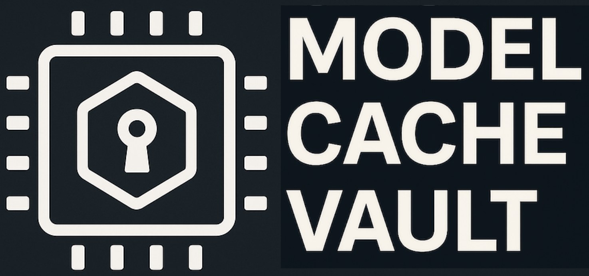

# Model Cache Vault (MCV)



A Model/GPU kernel cache container packaging utility inspired by
[WASM](https://github.com/solo-io/wasm/blob/master/spec/README.md).

## Features

- Build container images containing GPU Kernel/Model caches
- Extract a cache from an OCI image
- Compatible with docker or buildah (`--builder` to force one)
- Push and pull images to/from a container registry
- Sign and verify images with [Sigstore Cosign](https://docs.sigstore.dev/) (keyless or key-based)
- **Single-layer image output** (squashed) for cosign, `docker save`, and kind load
- Client API for retrieving and extracting images
- GPU discovery, stub mode, and image compatibility preflight checks

### Kernel cache image signing

- Built-in Cosign v3 signing and verification (`--sign` / `--verify`)
- Keyless (Fulcio/OIDC) and key-based (file, KMS, PKCS#11, k8s, git) workflows
- **Single-layer images**: MCV produces one squashed compat layer with Docker Schema 2 media types (Docker builder) or OCI layer types (Buildah)

## Build Instructions

### Requirements

- Go 1.25.0 or later

### Install dependencies

System dependencies:
```bash
sudo dnf install gpgme-devel
sudo dnf install btrfs-progs-devel
```

Optional: Install the Cosign CLI if you need to generate your own signing key pairs.
On RPM-based systems, install from the [GitHub releases](https://github.com/sigstore/cosign/releases/latest):
```bash
LATEST_VERSION=$(curl -sL https://api.github.com/repos/sigstore/cosign/releases/latest | grep tag_name | cut -d : -f2 | tr -d 'v", ')
sudo dnf install "https://github.com/sigstore/cosign/releases/latest/download/cosign-${LATEST_VERSION}-1.$(uname -m).rpm"
```

Alternatively, install with Go:
```bash
go install github.com/sigstore/cosign/v3/cmd/cosign@latest
```

Build the binary:

```bash
make build
```

After the binary is built, it can be found in an arch specific directory,
something like `./_output/bin/linux_amd64/mcv`. To install the binary in
the local `~/go/bin` directory, run (make sure `~/go/bin` is in $PATH):

```bash
make install
```

## Usage

Below is the `mcv` usage:

```bash
$ mcv -h
mcv is a utility for managing GPU kernel runtime container images.
It supports creating OCI images from cache directories, extracting caches from images,
pushing and pulling registry images, Cosign sign/verify, and hardware compatibility checks.

Usage:
  mcv [flags]

Flags:
  -b, --baremetal                               Enable detailed baremetal preflight checks
      --builder string                          Specify the builder to use (buildah or docker)
      --certificate-identity string             The identity expected in a valid Fulcio certificate...
      --certificate-identity-regexp string      A regular expression alternative to --certificate-identity...
      --certificate-oidc-issuer string          The OIDC issuer expected in a valid Fulcio certificate...
      --certificate-oidc-issuer-regexp string   A regular expression alternative to --certificate-oidc-issuer...
      --check-compat                            Check GPU compatibility with specified image
  -c, --create                                  Create OCI image from cache directory
  -d, --dir string                              Triton/vLLM cache directory path
  -e, --extract                                 Extract Triton/vLLM cache from OCI image
      --gpu-info                                Display GPU-specific information
  -h, --help                                    help for mcv
  -i, --image string                            OCI image name (required for create, extract, check-compat, push, pull, sign, verify)
      --insecure-ignore-tlog                    ignore transparency log verification being unavailable / unsuccessful (use with --verify; keyless or key-based)
      --key string                              path to the private key file, KMS URI or Kubernetes Secret for signing/verification (use with --sign or --verify)
  -l, --log-level string                        Set logging verbosity (debug, info, warning, error) (default "info")
      --no-gpu                                  Disable GPU detection and preflight checks (for testing)
      --pull                                    Pull image from registry
      --push                                    Push image to registry
  -s, --sign                                    Sign the image in the registry (standalone or with --push)
      --stub                                    Use mock/stub data for hardware info (for testing)
  -t, --timeout int                             Timeout in minutes for hardware detection operations (0 = disable timeout) (default 10)
      --verify                                  Verify the image signature (standalone or with --pull)
  -v, --version                                 version for mcv
  -y, --yes                                     skip confirmation prompts for some irreversible actions (use with --sign)
```

> **Note:** `--image` is required for `--create`, `--extract`, `--check-compat`, `--push`, `--pull`, `--sign`, and `--verify`.
> By default MCV prefers Buildah when installed, otherwise Docker; use `--builder buildah|docker` to force one.
> Compat image layout details: [spec-compat.md](./docs/spec-compat.md).

### No-GPU Mode

MCV supports creating and extracting cache images **without GPU hardware** using the `--no-gpu` flag. This is useful for CI/CD pipelines, development environments, and containerized workflows where GPU access isn't available.

**Quick Start:**

```bash
# Create cache image without GPU
mcv --create --image quay.io/myorg/cache:v1 --dir /path/to/cache --no-gpu

# Extract cache without GPU validation
mcv --extract --image quay.io/myorg/cache:v1 --dir /path/to/cache --no-gpu
```

**Container Images:**

Two image variants are available:

1. **Unified** (~533MB) - NVIDIA + AMD GPU support, auto-detects GPU vendor at runtime
   ```bash
   make build-image-mcv
   # or directly:
   podman build --target mcv-unified -t quay.io/gkm/mcv:unified -f mcv/images/Containerfile .
   ```

2. **No-GPU** (~176MB) - For `--no-gpu` workflows, arm64/mac; no CUDA/ROCm libraries
   ```bash
   make build-image-mcv-no-gpu
   # or directly:
   podman build --target mcv-minimal -t quay.io/gkm/mcv:no-gpu -f mcv/images/Containerfile .
   ```

**How it works:** With `--no-gpu`, MCV extracts GPU information (backend, architecture, warp size) from cache metadata rather than detecting actual hardware. The cache files created by vLLM/Triton already contain all necessary GPU information in environment variables.

**GPU access flags** (e.g., `--gpus all` for NVIDIA, `--device /dev/kfd --device /dev/dri` for AMD) are **ONLY** required for GPU validation/preflight checks. They are **NOT** needed when using `--no-gpu` for cache creation or extraction.

For detailed usage examples, container configuration, GPU access requirements, and CI/CD integration, see [docs/no-gpu-usage.md](./docs/no-gpu-usage.md).

## Dependencies

- [buildah dependencies](https://github.com/containers/buildah/blob/main/install.md#building-from-scratch)

## GPU Kernel Image Container Specification

### Cache Image Container Specification

The Cache Image specification defines how MCV packages and extracts Triton/vLLM
caches as container images. **Compat** images use standard gzip tarball layers;
extract routing is based on **layer media type**, not manifest type. Details:
[spec-compat.md](./docs/spec-compat.md)

### vLLM Binary Cache Support

MCV supports legacy Triton caches, binary caches, and AOT / mega-AOT layouts:

1. **vLLM Triton Cache Format** (legacy) - Stores `triton_cache/` and
   `inductor_cache/` inside rank directories
2. **vLLM Binary Cache Format** (current default) - Stores prefix directories
   (e.g., `backbone/`) with embedded Triton kernels inside rank directories
3. **vLLM AOT / Mega-AOT Format** - Detects `torch_aot_compile/` layouts from
   `VLLM_USE_AOT_COMPILE` / `VLLM_USE_MEGA_AOT_ARTIFACT`

For detailed information about vLLM binary and AOT cache support, see:
[vllm-binary-cache.md](./docs/vllm-binary-cache.md)

### Triton Cache Example

To extract the Triton Cache for the
[01-vector-add.py](https://github.com/triton-lang/triton/blob/main/python/tutorials/01-vector-add.py)
tutorial from [Triton](https://github.com/triton-lang/triton), run the
following:

```bash
mcv -e -i quay.io/gkm/vector-add-cache:rocm
Img fetched successfully!!!!!!!!
Img Digest: sha256:b6d7703261642df0bf95175a64a01548eb4baf265c5755c30ede0fea03cd5d97
Img Size: 525
bash-4.4#
```

This will extract the cache directory from the
`quay.io/gkm/vector-add-cache:rocm` container image and copy it to
`~/.triton/cache/`.

To Create an OCI image for a Triton Cache using docker run the
following:

```bash
mcv -c -i quay.io/gkm/vector-add-cache:rocm -d example/vector-add-cache-rocm
INFO[2026-07-27 21:37:05] Setting log level: info
INFO[2026-07-27 21:37:05] Using docker to build the image
INFO[2026-07-27 21:37:05] Detected cache components: [triton]
INFO[2026-07-27 21:37:05] Dockerfile generated successfully at /tmp/.mcv/docker/Dockerfile
{"stream":"Step 1/9 : FROM scratch AS build"}
{"stream":"\n"}
{"stream":" ---\u003e \n"}
{"stream":"Step 2/9 : COPY \"./io.triton.cache/\" \"./io.triton.cache/\""}
{"stream":"\n"}
{"stream":" ---\u003e aa1fa6bcd3db\n"}
{"stream":"Step 3/9 : COPY \"./io.triton.manifest/manifest.json\" \"./io.triton.manifest/manifest.json\""}
{"stream":"\n"}
{"stream":" ---\u003e 57d1c4815d2e\n"}
{"aux":{"ID":"sha256:57d1c4815d2ede3d2ed3b64a9e5f062577ca8dd501c8b59c5d90b3351bd06b47"}}
{"stream":"Step 4/9 : FROM scratch"}
{"stream":"\n"}
{"stream":" ---\u003e \n"}
{"stream":"Step 5/9 : LABEL org.opencontainers.image.title=vector-add-cache"}
{"stream":"\n"}
{"stream":" ---\u003e Running in 6e7dce4e97bc\n"}
{"stream":" ---\u003e e8b4014c2ae2\n"}
{"stream":"Step 6/9 : COPY --from=build / /"}
{"stream":"\n"}
{"stream":" ---\u003e ddcb3cce60a7\n"}
{"stream":"Step 7/9 : LABEL cache.triton.image/cache-size-bytes=80415"}
{"stream":"\n"}
{"stream":" ---\u003e Running in 1e196c7ace14\n"}
{"stream":" ---\u003e 56aa910decff\n"}
{"stream":"Step 8/9 : LABEL cache.triton.image/entry-count=1"}
{"stream":"\n"}
{"stream":" ---\u003e Running in af4bb8ba633c\n"}
{"stream":" ---\u003e ce2af41bccb7\n"}
{"stream":"Step 9/9 : LABEL cache.triton.image/summary={\"targets\":[{\"backend\":\"hip\",\"arch\":\"gfx90a\",\"warp_size\":64}]}"}
{"stream":"\n"}
{"stream":" ---\u003e Running in d97c0447e121\n"}
{"stream":" ---\u003e 170e5776a1f5\n"}
{"aux":{"ID":"sha256:170e5776a1f56a8e8e3a8a4398aaf814e196f72001d9a63aabcc3055ecd238ae"}}
{"stream":"Successfully built 170e5776a1f5\n"}
{"stream":"Successfully tagged quay.io/gkm/vector-add-cache:rocm\n"}
INFO[2026-07-27 21:37:06] Docker image built successfully
INFO[2026-07-27 21:37:06] OCI image created successfully.
```

To see the new image:

```bash
docker images

IMAGE                               ID             DISK USAGE   CONTENT SIZE   EXTRA
quay.io/gkm/vector-add-cache:rocm   170e5776a1f5        136kB         21.2kB
```

To verify the image has a single layer (important for cosign compatibility):

```bash
docker inspect quay.io/gkm/vector-add-cache:rocm | jq '.[0].RootFS.Layers | length'
1
```

To inspect the docker image with Skopeo (note the **single layer** due to squashing):

> **Note**: Use `docker-daemon:` prefix for Docker images, not `containers-storage:` (which is for Buildah/Podman).

```bash
skopeo inspect docker-daemon:quay.io/gkm/vector-add-cache:rocm
{
    "Name": "quay.io/gkm/vector-add-cache",
    "Digest": "sha256:97bd4cb83b692bebed5adc4cd92647478052719e4c7771562af31d1aef198cb8",
    "RepoTags": [],
    "Created": "2026-07-27T21:37:05.971275986-04:00",
    "DockerVersion": "",
    "Labels": {
        "cache.triton.image/cache-size-bytes": "80415",
        "cache.triton.image/entry-count": "1",
        "cache.triton.image/summary": "{\"targets\":[{\"backend\":\"hip\",\"arch\":\"gfx90a\",\"warp_size\":64}]}",
        "org.opencontainers.image.title": "vector-add-cache"
    },
    "Architecture": "amd64",
    "Os": "linux",
    "Layers": [
        "sha256:4d49b8253e60536d82418c622032c65ab3f31235e92b6d12cb29a9131c2aef04"
    ],
    "LayersData": [
        {
            "MIMEType": "application/vnd.docker.image.rootfs.diff.tar.gzip",
            "Digest": "sha256:4d49b8253e60536d82418c622032c65ab3f31235e92b6d12cb29a9131c2aef04",
            "Size": 93184,
            "Annotations": null
        }
    ],
    "Env": [
        "PATH=/usr/local/sbin:/usr/local/bin:/usr/sbin:/usr/bin:/sbin:/bin"
    ]
}
```

> **Note**: If `buildah` is installed it will be favoured to build the image.
The build output is shown below.

```bash
mcv -c -i quay.io/gkm/vector-add-cache:rocm -d example/vector-add-cache-rocm
INFO[2025-05-28 12:23:04] baremetalFlag false
INFO[2025-05-28 12:23:04] Using buildah to build the image
INFO[2025-05-28 12:23:04] Wrote manifest to /tmp/buildah-manifest-dir-2780945232/manifest.json
INFO[2025-05-28 12:23:04] Image built! baadff55392c0ada6f0d358c255d63ca770fb20b87429a732480e00bbf8d044b
INFO[2025-05-28 12:23:04] Temporary directories successfully deleted.
INFO[2025-05-28 12:23:04] OCI image created successfully.
```

To inspect the buildah image with Skopeo

```bash
skopeo inspect containers-storage:quay.io/gkm/vector-add-cache:rocm
{
    "Name": "quay.io/gkm/vector-add-cache",
    "Digest": "sha256:3f8c7b3aeeffd9ee3f673486f3bc681a7f9ed39e21242628e6845755191d6bd4",
    "RepoTags": [],
    "Created": "2025-05-28T15:45:17.379786001Z",
    "DockerVersion": "",
    "Labels": {
        "cache.triton.image/cache-size-bytes": "80415",
        "cache.triton.image/entry-count": "1",
        "cache.triton.image/summary": "{\"targets\":[{\"backend\":\"hip\",\"arch\":\"gfx90a\",\"warp_size\":64}]}"
    },
    "Architecture": "amd64",
    "Os": "linux",
    "Layers": [
        "sha256:ef89050f71ecc3dc925f14c12d2fd406c067f78987eed36a1176b19499c8ea20"
    ],
    "LayersData": [
        {
            "MIMEType": "application/vnd.oci.image.layer.v1.tar",
            "Digest": "sha256:ef89050f71ecc3dc925f14c12d2fd406c067f78987eed36a1176b19499c8ea20",
            "Size": 93184,
            "Annotations": null
        }
    ],
    "Env": null
}
```

To inspect the image labels specifically run:

```bash
skopeo inspect containers-storage:quay.io/gkm/vector-add-cache:rocm | jq -r '.Labels["cache.triton.image/summary"]' | jq .
{
  "targets": [
    {
      "backend": "hip",
      "arch": "gfx90a",
      "warp_size": 64
    }
  ]
}
```

### vLLM Cache example

To Create an OCI image for a vLLM Cache run the following:

```bash
mcv -c -i quay.io/gkm/cache-examples:vllm-example -d example/vllm-cache
INFO[2025-09-03 09:04:15] Hardware accelerator(s) detected (2). GPU support enabled.
INFO[2025-09-03 09:04:15] Using buildah to build the image
INFO[2025-09-03 09:04:23] Detected cache components: [vllm]
INFO[2025-09-03 09:04:24] Image built! 8218fac0225882a7de7a1f11f32aff25df2936f1f12b08c0c26ab30897d19c5a
INFO[2025-09-03 09:04:24] OCI image created successfully.
```

To inspect the image labels specifically run:

```bash
skopeo inspect containers-storage:quay.io/gkm/cache-examples:vllm-example
{
    "Name": "quay.io/gkm/cache-examples",
    "Digest": "sha256:9e731d58adccd608cb18dcefe259acd30ffe976d5e98208a4158ce22c0b5d1e2",
    "RepoTags": [],
    "Created": "2026-02-10T12:04:38.260317569Z",
    "DockerVersion": "",
    "Labels": {
        "cache.vllm.image/cache-size-bytes": "2269180",
        "cache.vllm.image/entry-count": "1",
        "cache.vllm.image/summary": "{\"targets\":[{\"backend\":\"hip\",\"arch\":\"gfx90a\",\"warp_size\":64}]}"
    },
    "Architecture": "amd64",
    "Os": "linux",
    "Layers": [
        "sha256:440b5cbd3b76dc17a6012e17fc56341d4894b88ab7a85b12c5e2f6f7c4b80661"
    ],
    "LayersData": [
        {
            "MIMEType": "application/vnd.oci.image.layer.v1.tar+gzip",
            "Digest": "sha256:440b5cbd3b76dc17a6012e17fc56341d4894b88ab7a85b12c5e2f6f7c4b80661",
            "Size": 250291,
            "Annotations": null
        }
    ],
    "Env": null
}
```

To extract the vLLM Cache run the following:

```bash
mcv -e -i quay.io/gkm/cache-examples:vllm-example
INFO[2025-09-03 09:06:00] Hardware accelerator(s) detected (2). GPU support enabled.
INFO[2025-09-03 09:06:02] Preflight GPU compatibility check passed.
INFO[2025-09-03 09:06:02] Preflight completed                           matched="[0 1]" unmatched="[]"
INFO[2025-09-03 09:06:04] Extracting cache to directory: /home/fedora/.cache/vllm
```

## Pushing and Signing Container Images

MCV can push and pull images, and sign/verify them with embedded
[Sigstore Cosign](https://docs.sigstore.dev/) v3.

Signing methods:

1. **Keyless** (default) — Sigstore Fulcio / OIDC; no pre-generated keys
2. **Key-based** — private/public key pair (file, KMS, PKCS#11, Kubernetes secret, or git provider)

`--sign` and `--verify` work standalone, or with `--push` / `--pull`.
Sign and verify always resolve the image to a digest first (TOCTOU-safe).
With `--pull --verify`, the verified digest is what gets pulled.

### Push without signing

```bash
mcv --push --image quay.io/gkm/vector-add-cache:rocm
# Optional: force docker or buildah for the push/pull storage backend
mcv --push --builder docker --image quay.io/gkm/vector-add-cache:rocm
```

### Push and Sign Workflow - Keyless (Sigstore)

After creating an image locally, push it to a registry and sign it with keyless signing:

```bash
mcv --push --sign --image quay.io/gkm/vector-add-cache:rocm
```

Or sign an image that is already in the registry:

```bash
mcv --sign --image quay.io/gkm/vector-add-cache:rocm
```

The `--push` flag pushes the image to the registry, and `--sign` (alone or with `--push`) signs it using keyless Sigstore signing.

### Push and Sign Workflow - Key-Based

MCV supports multiple types of key storage for signing. Choose the approach that fits your security model.

#### Local File-Based Keys

To use local file-based keys, first generate a key pair:

```bash
# Generate a private/public key pair (you'll be prompted for a password)
cosign generate-key-pair
```

This creates:
- `cosign.key` - private key (encrypted with your password)
- `cosign.pub` - public key

Then push and sign with the private key:

```bash
mcv --push --sign --image quay.io/gkm/vector-add-cache:rocm --key ./cosign.key
```

Or sign an already-pushed image:

```bash
mcv --sign --image quay.io/gkm/vector-add-cache:rocm --key ./cosign.key
```

You will be prompted for the private key password unless `COSIGN_PASSWORD` is set.
To automatically accept cosign agreements without prompting, add the `--yes` flag:

```bash
mcv --sign --image quay.io/gkm/vector-add-cache:rocm --key ./cosign.key --yes
```

#### Key Storage Options

MCV supports the following key reference formats via the `--key` flag:

**1. File Paths** (local PEM files)
- **Example:** `./cosign.key` or `/path/to/private.key`
- **Supported formats:** RSA (PKCS#1.5), ECDSA, Ed25519
- **Can be:** password-protected

**2. KMS Providers** (Cloud Key Management Systems)
- **AWS KMS:** `aws://arn:aws:kms:REGION:ACCOUNT:key/KEY-ID`
- **Google Cloud KMS:** `gcpkms://projects/PROJECT/locations/LOCATION/keyRings/RING/cryptoKeys/KEY`
- **Azure Key Vault:** `azurekms://VAULT-NAME.vault.azure.net/keys/KEY-NAME/VERSION`
- **Hashicorp Vault:** `vault://vault-server/path/to/key`
- **Note:** Requires appropriate cloud credentials configured

**3. PKCS#11 Hardware Security Modules (HSMs)**
- **Example:** `pkcs11:token=YubiKey;slot-id=0;id=1;object=my-key?module-path=/usr/lib/libykcs11.so`
- **Use cases:** Hardware tokens (YubiKey, Thales, etc.), enterprise HSMs
- **PIN:** Can be provided via `COSIGN_PKCS11_PIN` environment variable

**4. Kubernetes Secrets**
- **Example:** `k8s://namespace/secret-name`
- **Use cases:** Running in Kubernetes clusters with secrets management

**5. Git Providers** (GitHub/GitLab)
- **GitHub:** `github://user/repo` (fetches from COSIGN_PRIVATE_KEY secret)
- **GitLab:** `gitlab://user/repo` (fetches from COSIGN_PRIVATE_KEY secret)
- **Use cases:** CI/CD pipelines with Git provider secret management

### Verify Workflow - Keyless (Sigstore)

To verify an image signed with keyless (OIDC) signing (without pulling):

```bash
mcv --verify --image quay.io/gkm/vector-add-cache:rocm
```

Or verify then pull (pull uses the verified digest):

```bash
mcv --pull --verify --image quay.io/gkm/vector-add-cache:rocm
```

Pull without verification:

```bash
mcv --pull --image quay.io/gkm/vector-add-cache:rocm
```

Verify using a valid Fulcio-issued certificate and matching issuer:

```bash
mcv --verify --image quay.io/gkm/vector-add-cache:rocm \
  --certificate-identity "https://github.com/org/repo/.github/workflows/release.yml@refs/tags/v1.0.0" \
  --certificate-oidc-issuer "https://token.actions.githubusercontent.com"

# Or with regexps:
mcv --verify --image quay.io/gkm/vector-add-cache:rocm \
  --certificate-identity-regexp ".*@example.com" \
  --certificate-oidc-issuer-regexp "https://.*"
```

> **Note:** Identity constraints require both an identity matcher and an issuer matcher.

### Verify Workflow - Key-Based

To verify an image signed with a private key using the public key (same key reference formats as signing; see [Key Storage Options](#key-storage-options) above):

```bash
mcv --verify --image quay.io/gkm/vector-add-cache:rocm --key ./cosign.pub
```

Or verify then pull:

```bash
mcv --pull --verify --image quay.io/gkm/vector-add-cache:rocm --key ./cosign.pub
```

For KMS-backed keys, the same reference works for verification:

```bash
# AWS KMS
mcv --verify --image quay.io/gkm/vector-add-cache:rocm --key aws://arn:aws:kms:us-east-1:123456789:key/abc123
```

> **Note:** By default, verification checks the transparency log (Rekor). Use
> `--insecure-ignore-tlog` with `--verify` (keyless or key-based) to skip that
> check when a signature has no Rekor entry.

## MCV Client API

### Extracting a Cache from a Container Image

An example snippet of how to use the client API to extract a Cache from a
container image is shown below.

```go
package main

import (
	"github.com/redhat-et/GKM/mcv/pkg/client"
)

func main() {
	_, _, err := client.ExtractCache(client.Options{
		ImageName:       "quay.io/gkm/cache-examples:vector-add-cache-cuda",
		CacheDir:        "/tmp/testcache",
		LogLevel:        "debug",
		EnableBaremetal: nil, // or false if explicitly desired
	})
	if err != nil {
		panic(err)
	}
}
```

### Detecting System GPU Devices

You can also use the MCV client API to retrieve details about the system's
available GPUs:

```go
package main

import (
    "encoding/json"
    "fmt"
    "log"

    "github.com/redhat-et/GKM/mcv/pkg/client"
)

func main() {
    stub := false
    gpus, err := client.GetSystemGPUInfo(client.HwOptions{EnableStub: &stub})
    if err != nil && gpus == nil {
        log.Fatalf("Error retrieving GPU info: %v", err)
    }

    output, err := json.MarshalIndent(gpus, "", "  ")
    if err != nil {
        log.Fatalf("Failed to format GPU info: %v", err)
    }

    fmt.Println("Detected GPU Devices:")
    fmt.Println(string(output))
}
```

### Checking Image Compatibility with Host GPUs

```go
package main

import (
    "fmt"
    "log"

    "github.com/redhat-et/GKM/mcv/pkg/client"
)

func main() {
    matched, unmatched, err := client.PreflightCheck(
        "quay.io/gkm/cache-examples:vector-add-cache-cuda")
    if err != nil {
        log.Fatalf("Preflight check failed: %v", err)
    }

    fmt.Printf("Compatible GPUs: %d\n", len(matched))
    for i, gpu := range matched {
        fmt.Printf("  MATCH %d: Backend=%s, Arch=%s, WarpSize=%d, "+
            "PTX=%s\n", i, gpu.Backend, gpu.Arch, gpu.WarpSize,
            gpu.PTXVersion)
    }

    fmt.Printf("Incompatible GPUs: %d\n", len(unmatched))
    for i, gpu := range unmatched {
        fmt.Printf("  NO-MATCH %d: Backend=%s, Arch=%s, WarpSize=%d, "+
            "PTX=%s\n", i, gpu.Backend, gpu.Arch, gpu.WarpSize,
            gpu.PTXVersion)
    }
}
```

### Static Device Configuration (Stub Mode)

MCV supports running in environments without GPUs by using a static device
configuration. This is useful for testing or CI environments.

#### Stub Mode Usage

Run MCV with the `--stub` flag. It will use the static config and behave as
if those devices are present.

## Using MCV image to build cache images

MCV provides a container image called `quay.io/gkm/mcv`. Use it to create a
cache OCI image (and optionally push/sign it) without installing mcv locally.
It is also used by the
[github workflow](../.github/workflows/mcv-build-example-images.yml).

Mount the cache directory into the container, create the image with
`mcv --create`, then push (and optionally sign) with `mcv --push` /
`mcv --push --sign`. Registry auth must be available inside the container
(for example via mounted docker/podman credentials or `buildah login`).

### Create, push, and sign (registry)

```bash
# Docker host
docker run --rm -it --privileged \
  -v <path-to-cache>/example:/example \
  -v $HOME/.docker/config.json:/root/.docker/config.json:ro \
  quay.io/gkm/mcv bash -lc '
    /mcv -c -i quay.io/gkm/vector-add-cache:rocm \
        -d /example/vector-add-cache-rocm &&
    /mcv --push --sign -i quay.io/gkm/vector-add-cache:rocm
  '

# Podman host
podman run --rm -it --privileged \
  -v <path-to-cache>/example:/example \
  -v $XDG_RUNTIME_DIR/containers/auth.json:/run/containers/0/auth.json:ro \
  quay.io/gkm/mcv bash -lc '
    /mcv -c -i quay.io/gkm/vector-add-cache:rocm \
        -d /example/vector-add-cache-rocm &&
    /mcv --push --sign -i quay.io/gkm/vector-add-cache:rocm
  '
```

Push without signing:

```bash
/mcv --push -i quay.io/gkm/vector-add-cache:rocm
```

See [Pushing and Signing Container Images](#pushing-and-signing-container-images)
for keyless vs key-based options and verify/pull workflows.

### Export an archive for local docker/podman load

If you need the image on the host without pushing to a registry, export an
archive after create:

```bash
# Docker archive (load with: docker load -i .../vector-add-cache-rocm.tar)
docker run --rm -it --privileged \
  -v <path-to-cache>/example:/example \
  quay.io/gkm/mcv bash -lc '
    /mcv -c -i quay.io/gkm/vector-add-cache:rocm \
        -d /example/vector-add-cache-rocm --no-gpu &&
    buildah push containers-storage:quay.io/gkm/vector-add-cache:rocm \
        docker-archive:/example/vector-add-cache-rocm.tar:quay.io/gkm/vector-add-cache:rocm
  '

INFO[2025-09-11 16:46:54] Setting log level: info
INFO[2025-09-11 16:46:54] Using buildah to build the image
INFO[2025-09-11 16:46:54] Detected cache components: [triton]
INFO[2025-09-11 16:46:55] Image built! 8ce4bc2e98abfa8c0a5a6f6046c1c7bc8ac09805ecb029427a995dc2897828f8
INFO[2025-09-11 16:46:55] OCI image created successfully.
Getting image source signatures
Copying blob 24b82d6fef87 done
Copying config 8ce4bc2e98 done
Writing manifest to image destination
Storing signatures
```

Then on host:

```bash
docker load -i <path-to-cache>/example/vector-add-cache-rocm.tar
24b82d6fef87: Loading layer  93.18kB/93.18kB
The image quay.io/gkm/vector-add-cache:rocm already exists, renaming
the old one with ID sha256:5dc90b88f536e44e186c5a076afbb7a54389aed6f0ddfa21365ae2c7f79cb21d to empty string
Loaded image: quay.io/gkm/vector-add-cache:rocm
```

Check the images:

```bash
docker images
REPOSITORY                               TAG       IMAGE ID       CREATED          SIZE
quay.io/gkm/vector-add-cache             rocm      8ce4bc2e98ab   15 seconds ago   80.7kB
```

### MCV container image with podman

To use podman on the host with an MCV image, you need to mount the cache
directory to the container and run the following command:

# OCI archive (load with: podman load -i .../vector-add-cache-rocm.oci)
podman run --rm -it --privileged \
  -v <path-to-cache>/example:/example \
  quay.io/gkm/mcv bash -lc '
    /mcv -c -i quay.io/gkm/vector-add-cache:rocm \
        -d /example/vector-add-cache-rocm --no-gpu &&
    buildah push containers-storage:quay.io/gkm/vector-add-cache:rocm \
        oci-archive:/example/vector-add-cache-rocm.oci:quay.io/gkm/vector-add-cache:rocm
  '
```

```bash
podman load -i <path-to-cache>/example/vector-add-cache-rocm.oci
```

```bash
podman images
REPOSITORY                                TAG                         IMAGE ID      CREATED         SIZE
quay.io/gkm/vector-add-cache              rocm                        b1bc2ae6bef1  25 seconds ago  94.7 kB
```
